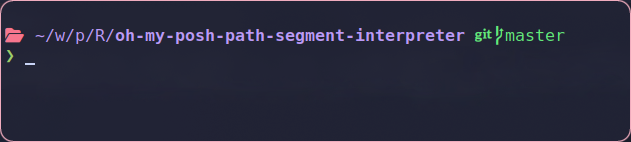

# oh-my-posh-path-segment-interpreter

A Rust-based utility to shorten the Oh My Posh path segment, inspired by Powerlevel10k's `POWERLEVEL9K_SHORTEN_STRATEGY`.

## Preview



## Features

- Shortens the Oh My Posh path segment
- Supports anchor files (which do not get truncated)
- Configurable shortening strategy

## Installation

1. Clone the repository:

   ```
   git clone https://github.com/yourusername/oh-my-posh-path-segment-interpreter.git
   cd oh-my-posh-path-segment-interpreter
   ```

2. Build and install the binary:
   ```
   cargo install --path .
   ```

## Configuration

### Shell Configuration

Add the following to your shell configuration file (e.g., `.zshrc`) after initializing Oh My Posh:

```bash
# oh-my-posh
eval "$(oh-my-posh init zsh --config ~/.config/oh-my-posh/oh-my-posh.toml)"

# add the following:
# exports the output of oh-my-posh-path-segment-interpreter to oh-my-posh.
function set_poshcontext() {
    export POSH_PATH=$(~/.cargo/bin/oh-my-posh-path-segment-interpreter -s -f 0.8)
}
```

### Oh My Posh Configuration

Add the following segment to your custom `oh-my-posh.toml`:

```toml
[[blocks.segments]]
type = "text"
style = "powerline"
alias = "Path"
invert_powerline = true
template = " {{ .Env.POSH_PATH }} "
```

## Usage

The program supports two arguments:

- `--stop-early` or `-s`: Only shorten the path until it fits inside the terminal. If not set, the whole path always gets shortened.
- `--factor` or `-f`: The percentage of the terminal width at which paths should be shortened (e.g., 0.8 for 80%).

Example:

```
oh-my-posh-path-segment-interpreter -s -f 0.8
```

## Contributing

Contributions are welcome! Please feel free to submit a Pull Request.
